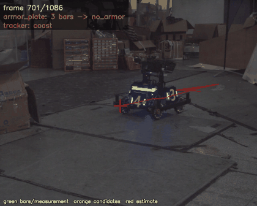
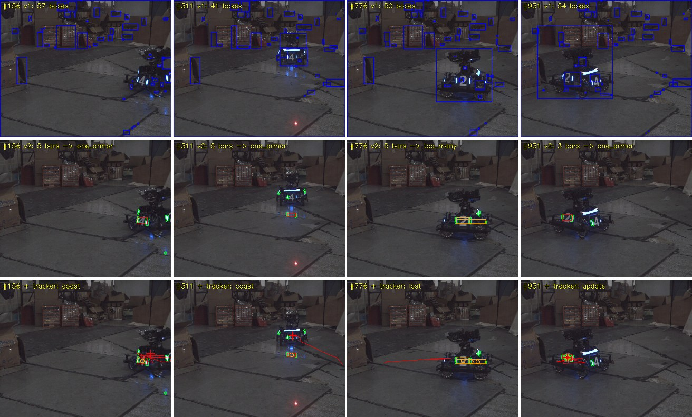
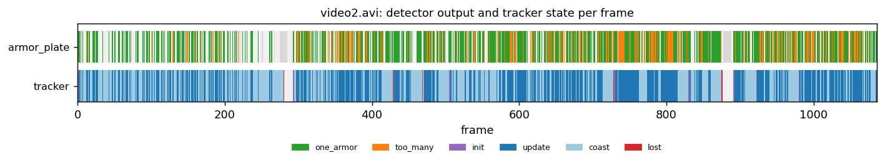
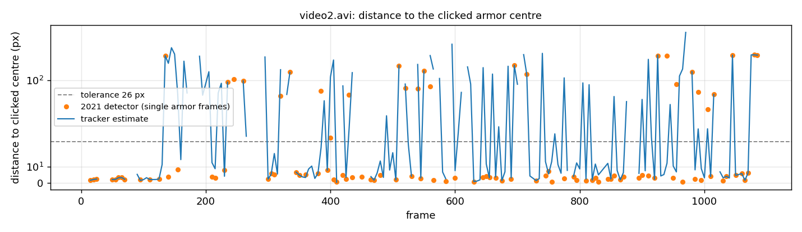

# Finding a robot in video — my first computer-vision task, measured five years later

In 2021 I joined the vision team of HITCRT, the RoboMaster robotics team at Harbin Institute of Technology. My
first task was to find the enemy robot in footage from the team camera. My first attempt did not work, the
second one did, and at the time I had no way of saying how well. This repository contains both attempts
unchanged, and a 2026 test harness that runs them on the original footage and measures them.



*The original 2021 recording (1280×1024, 50 fps). Green: light bars found by the 2021 detector. Red: the
position estimate of the tracker added in 2026, with its recent path.*

## In one minute

| | |
|---|---|
| **2021, attempt 1** — grayscale threshold | never finds the robot: 52 boxes per frame, one covering the whole image in every frame |
| **2021, attempt 2** — colour + light-bar geometry | reports a target in 48.3% of frames; **82.5% of those are correct** (median error 3.3 px) |
| **2026, tracker** — Kalman filter, gating, association | a correct position in **56.4%** of frames with a target, up from 40.3% |
| **The point** | before labelling I thought the tracker covered 96.9% of frames. 218 hand-labelled frames showed half of those positions were wrong, and I re-tuned against the labels instead of the coverage number. |

Read [what 218 labelled frames changed](#what-218-labelled-frames-changed) for that part, or
[running it](#running-it) to try it on your own video. The 2021 C++ code is in
[`original_2021/`](original_2021), unchanged.

## Attempt 1: the robot is the bright thing (wrong)

[`original_2021/carcarcar.cpp`](original_2021/carcarcar.cpp) converts the frame to grayscale, blurs it three
times, thresholds at a fixed value of 40, and draws the bounding box of every contour.

It never isolates the robot. On the original footage the threshold turns most of the image white, so the
contours it finds are the dark floor joints and shadows: a median of 52 boxes per frame, and in **every single
frame** one box covering the whole image. The idea that the target is simply "brighter than the rest" does not
survive contact with a real gym floor under stage lighting.

## Attempt 2: the robot is the blue thing, twice (right)

Competition robots carry two vertical LED light bars beside each armor plate, in the team colour. That is a
much stronger signal than brightness, and a pair of them is a distinctive geometric pattern.

[`original_2021/armor_plate/`](original_2021/armor_plate) subtracts the red channel from the blue one,
thresholds at 0.65 × the maximum value of that difference image and dilates. Contours are then filtered into
light-bar candidates by their ellipse angle and the aspect ratio of their minimum-area rectangle, and candidates
are paired into armor plates by four cascaded rules on angle difference, height difference, width difference
and vertical offset.



*The same four frames through all three stages. Top: attempt 1. Middle: attempt 2 — green light bars, red box
when exactly one armor plate is found, orange when several are. Bottom: attempt 2 plus the tracker.*

## What I could not see in 2021

The 2021 program prints `no armors!` or `too many armors!` and moves on, and back then I had no idea how often
that happened. Measured now over all 1086 frames of the original recording:

| Detector output | Share of frames |
|---|---|
| exactly one armor plate (a usable target) | **48.3%** |
| several candidates, program gives up | 18.5% |
| light bars found, none pair up | 30.5% |
| fewer than two light bars | 2.7% |



So the detector that felt like it "worked" produces a target in about half the frames. The gaps are mostly
short — 248 of them, a median of 1 frame, 90% shorter than 5 frames, the longest 28 frames (0.6 s) — which is
the signature of a per-frame detector flickering on a target that is still plainly there. A turret driven
directly by this signal would stutter constantly, and the fix is not a better threshold but remembering the
target between frames.

## 2026: turning intermittent detections into a continuous track

Detection per frame is the wrong abstraction — the robot does not disappear when a light bar does. So I added
what the 2021 code lacked: a constant-velocity Kalman filter on the armor centre
([`replay/tracking.py`](replay/tracking.py)). Each frame it predicts the next position, accepts the candidate
closest to that prediction if it falls inside a χ² gate, coasts when nothing matches, and drops the track after
a few coasting frames. This is the predict / gate / associate structure used by the team's later tracking code,
in a minimal 2-D form.

With that in place the share of frames holding *some* position jumped from 48.3% to 96.9% with my first
settings, and that is where I stopped the first time. It was the wrong place to stop. With the settings the
labels later forced (below), the same figure is 83.5%: a position in 51.1% of frames from a real measurement,
32.4% coasting, and 98 short tracks over 1086 frames instead of 5 long ones.

## What 218 labelled frames changed

Every number above counts outputs, not correct outputs. So I clicked the armor centre on every 5th frame of the
recording with [`label_frames.py`](label_frames.py): 218 frames, 211 of them with a visible target, 228 plates
in total because 17 frames show two plates at once. [`evaluate.py`](evaluate.py) scores a position as correct
when it lands within 2% of the frame width (25.6 px, roughly half an armor plate) of any plate clicked in that
frame.

| | correct when it reports | of all frames with a target | median error |
|---|---|---|---|
| 2021 detector, frames where it reports one plate | **82.5%** (85/103) | 40.3% | **3.3 px** |
| tracker, tuned (see below) | 66.9% (119/178) | **56.4%** | 6.8 px |
| ‣ on frames where it used a measurement | | | 4.8 px |
| ‣ on frames where it was coasting | | | **67.0 px** |



*Each orange dot is a frame where the 2021 detector reported a single plate; the blue line is the tracker.
Below the dashed line counts as correct. The detector is either right to within a few pixels or wrong by more
than 100 — there is very little in between.*

Three things came out of this that no coverage metric could have told me:

**The 2021 detector is accurate when it speaks.** Within 3.3 px of where I clicked, four times out of five. Its
problem was never precision, it was that it only speaks in 40% of the frames that have a target.

**The pairing rules, not the threshold, are the bottleneck.** In 59.2% of frames with a target, a correct plate
was among the candidates, but the four cascaded pairing rules either dropped it or reported several and gave
up. That is the upper bound any re-tuning of those rules could reach, and it is where I would work next.

**My headline tracking number was measuring the wrong thing.** Before labelling, the tracker with its original
settings covered 96.9% of frames and I was pleased with it. Against the labels, only 49.8% of target frames got
a *correct* position, its coasting estimates were off by a median of 96 px — four times the tolerance — and on
frames with no target at all it still held a position 57% of the time. Coverage had rewarded exactly the
behaviour that was hurting it.

### Re-tuning on the labels

[`tune_tracker.py`](tune_tracker.py) detects the video once and then scores 25 combinations of gate width and
coasting patience on the cached detections:

| gate σ (px) | coasting frames | correct, of target frames | precision | error while measuring | error while coasting | position on empty frames |
|---|---|---|---|---|---|---|
| 10 | 2 (new default) | **56.4%** | 67.6% | 4.1 px | 66.4 px | 28.6% |
| 10 | 0 (never coast) | 47.9% | **77.7%** | 4.9 px | — | **0.0%** |
| 25 | 15 (old default) | 49.8% | 51.0% | 14.4 px | 95.9 px | 57.1% |
| 50 | 15 | 38.9% | 39.8% | 27.5 px | 67.4 px | 42.9% |

Coasting buys coverage and pays for it in precision: every extra coasting frame adds positions that are mostly
wrong. The defaults are now a gate of 0.8% of the frame width and 2 coasting frames. If a wrong position is
worse than no position — which it is for a turret — never coasting is the better setting, and the tool makes
that trade-off visible instead of hiding it behind one number.

This tuning used 211 labelled frames of one video, so a few percent is a handful of frames. It is enough to
rank "coast for 15 frames" against "coast for 2", not enough to claim 10 px is better than 12.

### Two ways these accuracies flatter the algorithms

A position counts as correct when it is near **any** plate labelled in that frame, so the score does not check
that the algorithm picked the plate a turret should actually engage: with two robots in view, hitting either
one counts.

And the second plates were added in a second pass over the frames where a reported position had missed, which
is exactly where extra labels can turn a miss into a hit; frames the algorithms already got right were not
re-checked. Adding labels can only raise these numbers, never lower them. The unbiased procedure is to label
every visible plate in a random subset from the start, which is what I would do with more labelling time.

## Honest boundaries

- The stage-1 and stage-2 algorithms are the 2021 C++ code, kept unchanged under `original_2021/` (tag
  `original-2021`). `carcarcar.cpp` is a scratch file: it also contains pasted OpenCV `groupRectangles` source
  and camera calibration notes, which are not my code.
- The measurements come from a **Python replay** of that C++ code, not from running the C++ binary. The replay
  uses the same OpenCV calls, parameters and branch conditions; each deviation is marked `NOTE` in
  [`replay/pipelines.py`](replay/pipelines.py). The 2021 machine (Ubuntu, OpenCV built from source) no longer
  exists.
- The C++ `display()` function (PnP pose and ballistics) was never finished in 2021 and does not compile, so it
  is not replayed.
- **The ground truth is 218 frames of one video, clicked by me**, every 5th frame, 228 plates. The accuracy
  figures inherit that: a single scene, my own idea of where the centre of a plate is, a tolerance I chose, and
  the two biases described above. The frame-level percentages in the earlier sections (how often a stage
  produces any output) cover all 1086 frames.
- The first version of the labelling tool divided the click coordinates by the display scale, which OpenCV had
  already applied. Every label was 14% too far from the origin and the first evaluation scored 0/103 correct.
  The clicks were recoverable by scaling them back; the original file is kept as
  `labels/video2.buggy-coordinates.csv.bak`. A test now pins the label round trip.
- The tracker, the harness, the tests and this README are from 2026 and were written with help from an AI
  coding assistant. All numbers come from the scripts in this repository.

## Robustness on other footage

Five phone recordings of robots (1080×1920, not included here) give 12–38% single-armor frames and 57–96%
tracked frames, with the light-bar colour detected automatically. Two things break on them: the pixel
thresholds of the 2021 detector assume the original camera, so frames have to be downscaled to roughly 720 px
wide (`--proc-width`), and in a scene with both a blue and a red robot the automatic colour choice is
meaningless and has to be set by hand.

## Ground truth: labelling and scoring

Everything above counts *outputs*, not *correct outputs*. [`label_frames.py`](label_frames.py) is a click tool
for building the missing ground truth, and [`evaluate.py`](evaluate.py) scores both stages against it.

```bash
python label_frames.py video2.avi --every 5   # click the armor centre on every 5th frame
python evaluate.py video2.avi                 # score the detector and the tracker
```

In the labelling window: **left click** marks the armor plate the turret should aim at, **x** marks a frame
with no visible target, **n** skips, **b** goes back, **u** clears the frame and **q** saves and quits. Labels
go to `labels/<video>.csv` after every click, so the work survives a crash and the tool resumes at the first
unlabelled frame.

`evaluate.py` then replays the video and reports, for the labelled frames:

- how often the 2021 detector's single-armor output is within tolerance of the clicked centre — its precision,
  and its share of all frames that had a target;
- the same for the tracker, split into frames where it used a measurement and frames where it was coasting;
- how often the right pair was among the candidates but the pairing rules dropped it (an upper bound on what
  better pairing rules could reach);
- how often a target is reported on frames labelled as empty;
- median and 90th-percentile error in pixels, plus an error-over-time plot.

The default tolerance is 2% of the frame width (25.6 px at 1280), roughly half an armor plate at mid distance;
`--tol-px` overrides it. Scoring logic is unit-tested in [`tests/test_metrics.py`](tests/test_metrics.py).

A frame can show more than one armor plate, and a label that only marks one of them scores the detector wrong
when it picks the other. `evaluate.py` therefore writes the frames where a reported position missed every label
to `disputed_frames.txt`, so they can be re-checked without going through the whole video again:

```bash
python label_frames.py video2.avi --frames-file outputs/video2/disputed_frames.txt
python tune_tracker.py video2.avi     # re-tune once the labels change
```

## Running it

A six-second cut of the original recording is committed at `clips/robot_clip.mp4` (300 frames, 1280×1024,
untouched apart from the re-encoding), together with the labels for those frames, so everything below runs
after a clone:

```bash
pip install -r requirements.txt
python -m pytest                                 # 14 tests on synthetic frames
python run_videos.py clips/robot_clip.mp4        # plays it back with the detections drawn on
python evaluate.py clips/robot_clip.mp4          # scores both stages against the labels
python tune_tracker.py clips/robot_clip.mp4      # the gate/patience sweep, on the clip
```

On the clip the detector is right in 26 of the 29 frames where it reports a plate. The numbers quoted in this
README come from the full 1086-frame recording, which is 105 MB and not committed; `--proc-width 0` keeps the
native resolution the 2021 thresholds were written for.

```bash
python run_videos.py                               # every video in this folder, played back in a window
python make_figures.py video2.avi --proc-width 0   # rebuild the figures above, from the full recording
```

Each video is played back with the detections drawn on it and written to `outputs/<name>/annotated.mp4`;
**space** pauses, **n** skips, **q** quits, **s** saves a frame. Each run also writes `summary.json`, per-frame
`frames.csv`, contact sheets per stage and a trajectory plot.

| Option | Meaning |
|---|---|
| `--enemy auto\|blue\|red` | Light-bar colour; `auto` probes both on ~30 frames. |
| `--proc-width 720` | Downscale before detection (`0` = native). The 2021 thresholds assume light bars of 10–150 px. |
| `--meas-std`, `--max-coast`, `--accel-std` | Tracker gate, patience and process noise. |
| `--no-show`, `--no-video`, `--speed` | Batch mode, skip the mp4, playback speed. |

## Repository layout

| Path | What it is |
|---|---|
| [`original_2021/`](original_2021) | The 2021 C++ code, unchanged. |
| [`replay/pipelines.py`](replay/pipelines.py) | Python replay of both C++ programs. |
| [`replay/tracking.py`](replay/tracking.py) | The 2026 Kalman tracker. |
| [`replay/visualize.py`](replay/visualize.py) | Overlays, contact sheets, plots. |
| [`run_videos.py`](run_videos.py) | Playback and evaluation over one or more videos. |
| [`make_figures.py`](make_figures.py) | Builds the figures in this README. |
| [`label_frames.py`](label_frames.py) | Click tool for ground-truth armor centres. |
| [`evaluate.py`](evaluate.py) | Scores detector and tracker against those labels. |
| [`replay/metrics.py`](replay/metrics.py) | The scoring itself, unit-tested. |
| [`tests/`](tests) | Unit tests on synthetic frames: detection, colour selection, pairing rules, tracker gating, scoring. |
| [`clips/`](clips), [`labels/`](labels) | A six-second cut of the original recording and the frames I labelled by hand. |
